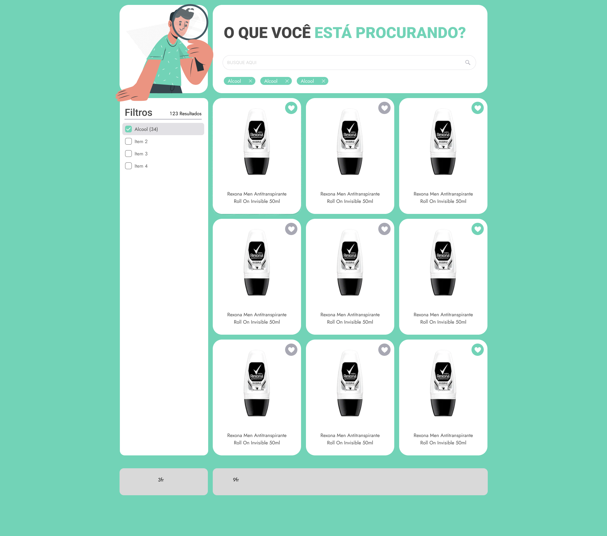
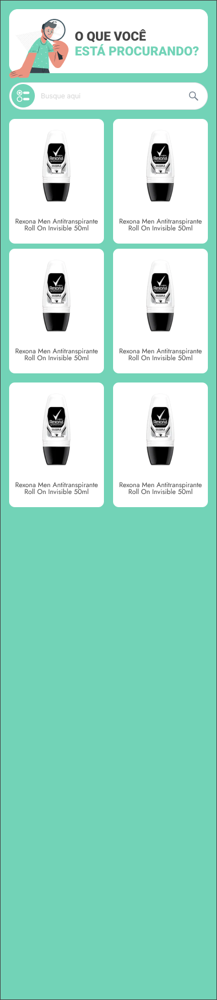

  

## "O que você está procurando?"  
A Search Component made with react and typescript.

## Layout
The layout was inspired in the Bento UI Design, which is an aproach about visual hierarchy and organization. It offers a clean, efficient design structure that's visually appealing. Its real power comes from its adaptability to small, rectangular layouts, making it a godsend for mobile-responsive designs.

  
  

<!-- 
 -->

### Todo (further improvements)

- [ ] Button load more;
- [ ] Fixed filters;