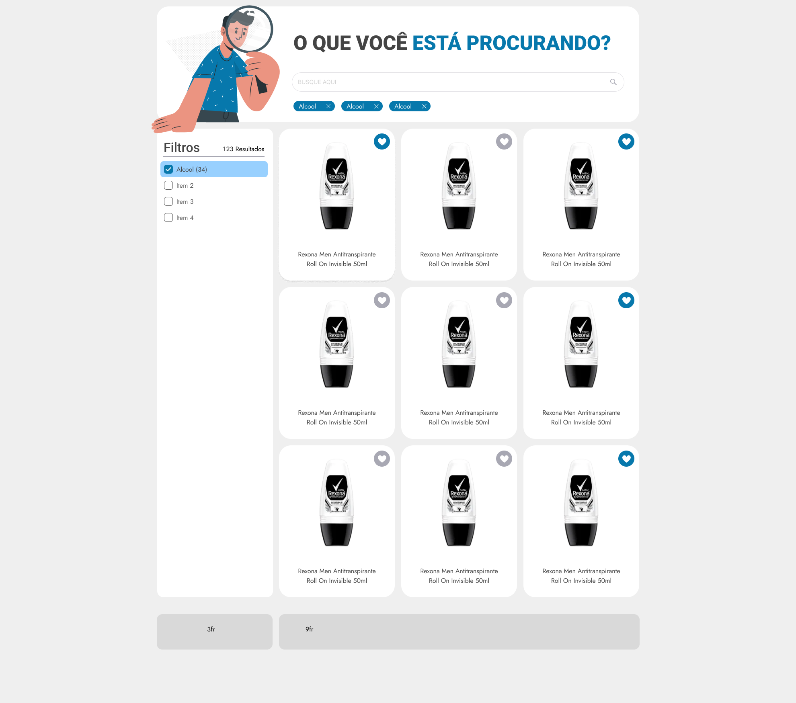

<div align="center">
  <a href="https://oquevcprocura.netlify.app/" target="_blank">
    
  </a>
</div>

## Welcome to "O que você está procurando?"

This is a dynamic Search Component built with React and TypeScript.

### Design Inspiration
The layout draws inspiration from the Bento UI Design, focusing on visual hierarchy and organization. It provides a clean, efficient structure that is visually appealing. Its real strength lies in its adaptability to small, rectangular layouts, making it perfect for mobile-responsive designs.

Explore more details in the [Figma project](https://www.figma.com/file/FkSkyHfMGyH4laPpxs0333/Other-Projects?type=design&node-id=37%3A95&mode=design&t=aN4PU55f7nK6zRuY-1).

<div>
  
  
</div>

## Colaborating  
To start this project, please ensure you have Node.js, npm, and Git installed on your system. You can find instructions on their websites if you haven't installed them yet.

Once you have the prerequisites in place, you can clone the repository using the following commands:

```bash
git clone https://github.com/guisalmeida/tbb-challenge-react.git
```

To run the project locally, navigate to the project folder and execute the following commands:

```bash
cd tbb-challenge-react/

npm install

npm run dev
```


### Todo (Upcoming Improvements)

- [ ] Button "load more";
- [ ] Fixed filters when scrolling down;
